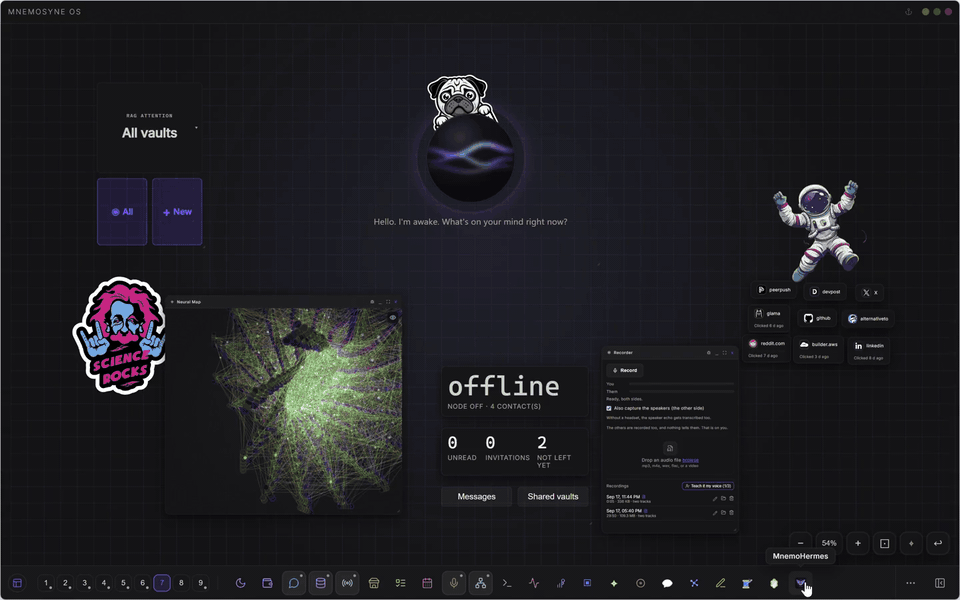

# MnemoHermes

A cockpit for your [Hermes Agent](https://github.com/NousResearch/hermes-agent):
see what it is doing, talk to it, manage its skills, and govern every memory it
writes into your vaults. A [Mnemosyne OS](https://github.com/Mnemosyne-OS/Mnemosyne-Neural-OS)
cartridge.

**Hermes roams the world. You govern what it remembers.**

<br clear="left">

<p align="center">
  
</p>

<p align="center"><sub>The cockpit inside Mnemosyne OS. What it does for you, step by step:
<a href="https://mnemosyne-os.io/hermes">mnemosyne-os.io/hermes</a></sub></p>

> [!WARNING]
> **MnemoHermes is in beta, and it is not in the store yet.**
>
> You add it by hand, by pasting this repo's URL into Mnemosyne OS (see
> [Installing it](#installing-it)). There is no catalog entry, no review and no
> signed listing behind it.
>
> What has actually been measured: **218 tests** over 17 files, and **7
> languages at key parity**. The security presets and the task approvals were
> written against the Hermes source, not against its documentation. The managed
> install pins one Hermes release (`v2026.9.21`) and checks its sha256.
>
> **Version 0.9.0 needs Mnemosyne OS 1.6.0 or later.** Its new tabs call host
> actions that earlier versions do not have.
>
> What nobody has watched: macOS, Linux, anyone else's Hermes layout, and any
> Hermes other than the one this was built beside. More importantly, four things
> about how Hermes behaves are **known gaps rather than open questions**, and
> they are listed in [What it does not know yet](#what-it-does-not-know-yet).
> Read that section before you rely on the profile screen.

---

Hermes is the agent runtime you install: messaging gateways, a real terminal, a
real browser, skills it writes for itself. What it does not have is governed
memory. Its own is flat files, with no vaults, no protection levels and no
provenance.

Hermes Agent is built and published by [Nous Research](https://nousresearch.com),
under the MIT licence:
[official site](https://hermes-agent.nousresearch.com) ·
[documentation](https://hermes-agent.nousresearch.com/docs) ·
[GitHub](https://github.com/NousResearch/hermes-agent) ·
[@nousresearch](https://x.com/nousresearch).

MnemoHermes is the outward half of the bridge. It does not live inside the
agent. It watches it from Mnemosyne OS and gives you the controls that otherwise
live in a YAML file and a terminal:

- **Status.** The install, the `api_server` and the gateway, with start, stop
  and the process's own journal. A managed child that has not bound its port yet
  reads as *starting*. Without Hermes, one button installs it: the app downloads
  the pinned release, builds it, and wires your memory in.
- **Tasks.** Start a run and follow its log. When Hermes asks before a risky
  command, you see the command, its reason and the time left, and you answer
  once, for the session, or always. The same question appears as a card on your
  board.
- **Chat.** Talk to the agent through its `api_server`, streamed token by token,
  with a Stop button. An agent turn runs tools and can take minutes, so the wait
  shows elapsed seconds. A microphone button lends you the app's microphone for
  one question, and replies can be spoken in the voice chosen in Settings ›
  Voice. An image the agent made or a document it wrote becomes its own card
  beside the conversation, with an **Open** button.
- **Agents.** One card per Hermes profile, each with its own Telegram token and
  its own gateway.
- **Channels.** Which messaging platforms are configured, who each bot is linked
  to, and the one form the cockpit is allowed to write (the main Telegram bot).
  Voice notes sent to the bot are transcribed on your machine. Spoken replies use
  either a free Microsoft voice in the app's language or the voice chosen in
  Settings › Voice; with the Microsoft voice, the text of each reply goes through
  Microsoft's speech service.
- **Tools.** The per-platform toolset grid. A messaging platform that carries a
  terminal gets flagged, because that is the configuration worth noticing.
- **Skills.** A switch per skill, where each one comes from, uninstall, import
  your own, and install any identifier through Hermes' own installer and its
  scan.
- **Memory inbox.** The reason this exists. Every chronicle the agent wrote into
  your vaults through MCP carries a signed provenance line. The inbox lists only
  those, as a queue: **keep**, **move** or **reject**. A note of yours that merely
  quotes the agent stays out of it.
- **Brain.** The loopback proxy that serves Mnemosyne OS's inference to Hermes,
  with a daily call cap, a daily token cap, and today's real spend.
- **Security presets.** Fortress, Balanced, YOLO. One click writes both sides
  of the bridge: Hermes' `config.yaml` and Mnemosyne OS's own call cap.

Nothing here mutates your agent behind your back. A preset click is the human
gesture, mediated; the cockpit never steers the agent's configuration on its own
initiative.

## Installing it

MnemoHermes is a cartridge: it runs inside Mnemosyne OS, in a sandboxed iframe.
You need the host first
([latest release](https://github.com/Mnemosyne-OS/Mnemosyne-Neural-OS/releases/latest),
1.6.0 or later). Hermes itself can be installed from the cockpit.

Then, in the app:

1. Open **MnemoHub**.
2. **Add an external cartridge**, then **A repository**.
3. Paste `https://github.com/Mnemosyne-OS/MnemoHermes` and press **Read it**.
4. Mnemosyne OS downloads the manifest and shows you the name, the version and the
   permissions *before* installing anything. Confirm with **Install**.

Two things worth knowing before you do that:

- **It spends your free external-cartridge slot.** Mnemosyne OS allows one
  cartridge from outside the store without a license, and a second one needs an
  active Engramm. A repo install and a local folder link draw on the same slot.
- **Updates come from this repo.** The manifest declares `updateStrategy: git`,
  so the app checks this URL rather than a catalog. Nothing is fetched on its
  own between those checks.

It asks for four permissions. `hermes:control` covers the install probe, the
config reads and writes, and the gateway. `vault:read` and `vault:write` are the
inbox, and they are deliberately separate from `hermes:control`, whose
description promises no access to vault content. `model:infer` is the brain
proxy, the microphone lent to the Chat tab, and the spoken replies.

## The three arrows, which are easy to confuse

| | Direction | What carries it |
|---|---|---|
| Memory **in** | Hermes reads and writes Mnemosyne OS vaults | `@mnemosyne_os/mcp`, under the `mnemosyne-memory` skill covenant |
| Control **out** | you observe and drive Hermes from Mnemosyne OS | this cartridge |
| Inference **served** | Hermes thinks with Mnemosyne OS's brain | a loopback OpenAI-compatible endpoint |

They share no code path. A problem with one says nothing about the others.

## What it does not know yet

These are gaps we have found and not yet closed. They are listed here, rather
than in a milestone list, because one of them can make a screen lie to you.

- **The profile screen may write into the void.** It writes `USER.md`, and
  Hermes carries a `user_profile_enabled` flag that this cockpit does not read.
  With that flag off, Hermes never injects the file into its prompt, and the
  screen still reports a success. Check the flag yourself until this is fixed.
- **Two memories can run in parallel and nobody says so.** When Mnemosyne OS serves
  the memory through MCP, Hermes' own `memory.memory_enabled` can still be on,
  spending tokens every turn on a memory you are not using. The cockpit neither
  shows nor measures that flag.
- **Turning off the `memory` toolset may do more than it says.** Whether
  disabling it from the Tools tab also cuts Hermes' access to Mnemosyne OS's MCP
  tools has **not been measured**. The screen says nothing about it on purpose,
  because a guess does not belong in an interface.
- **Session identity across `/new`, `/resume`, `/branch`, undo and context
  compaction is unaudited.** Hermes rebinds the active session on all five, and
  nobody has checked that the inbox and the channels follow.

## Which Mnemosyne is this?

The name is crowded, and one of the collisions sits directly in this domain.

- **This project** is Mnemosyne OS, a local-first memory operating system, at
  [mnemosyne-os.io](https://mnemosyne-os.io). MnemoHermes is one of its
  cartridges, and it drives Hermes from the outside.
- **`mnemosyne-oss/mnemosyne`** is a different project by a different author. It
  ships `mnemosyne-hermes`, a memory *provider* that installs **inside** Hermes.
  Same word, opposite position, unrelated codebase. If what you want is a
  provider living in the agent, that is the one.
- Mnemosyne is also a Titaness, a moth genus, and a fair amount of unrelated
  software. None of it is this.

## Building it

The published tree carries `dist/` already built, because installing a cartridge
downloads this repo and nothing compiles on your machine. To work on it:

```
pnpm install
pnpm dev          # standalone on http://127.0.0.1:5207, fallback styling
pnpm typecheck    # includes the tests, which the build project excludes
pnpm lint         # zero warnings tolerated
pnpm test
pnpm build
```

`dashboard-plugin/` is a scaffold of a plugin for Hermes' own dashboard. **It has
never run against a live dashboard.**

## What would help most

In order:

1. **A screen that claimed something untrue.** Top of the list regardless of how
   small it looks. A status that does not match your `config.yaml`, a count that
   is wrong, a "saved" that saved nothing.
2. **A Hermes layout this does not find.** It looks for `HERMES_HOME`, then the
   install the app manages, then `~/Documents/hermes`, then
   `%LOCALAPPDATA%\hermes`. If yours lives elsewhere,
   that is worth an issue.
3. **Anything on macOS or Linux.** Neither has been watched.

## Licence

MIT. See [LICENSE](LICENSE).

---

<sub>[mnemosyne-os.io](https://mnemosyne-os.io) · [mnemosyne-os.com](https://mnemosyne-os.com) · [docs.mnemosyne-os.io](https://docs.mnemosyne-os.io)</sub>
